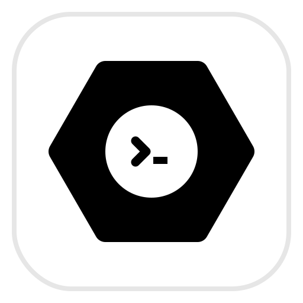

<div align="center">
  
  <h1>Steel</h1>
  <p><strong>A blazingly fast, local-first infinite canvas workspace built with Rust & React.</strong></p>
</div>

---

## Overview

Steel is an evolution of the traditional note-taking and coding workspace. It provides an infinite zooming canvas where you can freely organize notes, code snippets, local media, web pages, and even deep-scan your local OS directories to visualize dependencies.

Built on Tauri v2, Steel runs entirely offline, leveraging native OS capabilities to securely manipulate your files directly from the canvas.

## Features

- **Infinite Zoomable Canvas:** Pan and zoom freely using a deeply optimized WebGL-grade Transform system.
- **Native OS Drag & Drop:** Drop entire system folders into Steel. The advanced Rust backend will recursively parse, filter, and render your file hierarchy visually.
- **Smart AST Edge Generation:** Drop a codebase (`.js`, `.py`, `.ts`, etc.) and Steel will parse the Abstract Syntax Trees (AST) in Rust to automatically draw connecting dependency edges between files.
- **Radial Tag Engine:** A gorgeous hexagonal radial menu for managing multi-tags directly on the canvas, persisting global taxonomies.
- **Contextual Previews:** While editing a node, seamlessly glide through adjacent connections via immersive edge-screen sidebars without breaking focus.
- **In-App Media Viewer:** Securely load and view `.png`, `.mp4` and other media directly on the canvas without bloated Electron bridges.
- **Web Nodes:** Embed live `iframes` such as Wikipedia, YouTube, or Excalidraw natively onto your workspace.
- **Folder Management:** Group items in resizable boundary folders with elegant SVG Bezier connection curves.
- **P2P Multiplayer (Weld):** Real-time collaborative canvas syncing between users via secure Swarm WebRTC networking.
- **Auto-Hide Command CLI:** A sleek slide-up smart CLI docked to the screen bottom for executing global commands.
- **Native PTY Terminal Node:** Spawn hardware-accelerated, fully interactive Windows `cmd.exe` sessions directly inside canvas nodes via `/term`. Powered by Rust `portable-pty` and `xterm.js`.
- **Local First:** Everything is stored securely on your machine as JSON workspaces. Total privacy, no cloud required.
- **Dark Mode First:** Carefully crafted neutral aesthetics with seamless syntax highlighting.

## Tech Stack

- **Frontend:** React, TypeScript, TailwindCSS, Zustand (State Management), Lucide React (Icons), Xterm.js (WebGL Terminal emulator).
- **Backend:** Rust, Tauri v2 API, Portable-PTY (Native pseudo-terminals).
- **File Parsing & AST:** SWC (JavaScript/TypeScript), RustPython AST (Python).

## Project Architecture

The repository is modular and highly structured for rapid iteration:

```text
steel/
├── docs/                      # Assets.
├── src-tauri/                 # Rust Backend & OS Native code
│   ├── src/
│   │   ├── ast_tester.rs      # AST parsers for JS/TS/Python imports
│   │   └── lib.rs             # File filtering, pruning & recursive tree generation
│   ├── capabilities/          # Tauri v2 security scopes & capabilities
│   └── tauri.conf.json        # Main Tauri entrypoint & asset protocol
└── src/                       # React Frontend
    ├── components/
    │   ├── canvas/            # WebGL-inspired canvas, nodes, edges & zoom
    │   ├── folders/           # Visual folder boundaries
    │   ├── nodes/             # Markdown, Code, and Media node rendering
    │   └── ui/                # Context menus, CLI bar, modal Note editor
    ├── lib/                   # Persistence logic (JSON graph IO)
    ├── store/                 # Zustand central state store (Nodes, Edges, Folders)
    ├── types/                 # TypeScript interfaces
    └── App.tsx                # Main Router
```

## Development & Installation

### Prerequisites

- Node.js (v18+)
- Rust (Latest Stable)
- OS-specific build tools for Tauri (e.g., MSVC on Windows).

### Running Locally

1. Clone the repository:

   ```bash
   git clone https://github.com/JaumeLloretRubio/Steel.git
   cd steel
   ```
2. Install frontend dependencies:

   ```bash
   npm install
   ```
3. Run the development environment:

   ```bash
   npm run tauri dev
   ```

   *(This will compile the Rust backend and launch the React dev server simultaneously)*

### Building for Production

Compile a native executable for your OS:

```bash
npm run tauri build
```

Binaries will be outputted to `src-tauri/target/release/bundle`.

## Self-Hosting & Official Service

Steel follows a **100% Open Source Core** philosophy. The code is free to read, compile, and modify. However, we offer an **Official Premium Tier** built for ease of use: it provides instant pre-compiled binaries, seamless Over-The-Air (OTA) native app updates (`/update`), and access to our high-speed, managed STUN/TURN `Weld` Multiplayer Swarm servers without any configuration.

If you purchase the official build, you will receive a JWT License Token. The premium version will be avaible right after the tests of the global release are done.
Connect to the official servers by activating your copy in the CLI:

```bash
/register [Your-JWT-License-Token]
```

### Self-Hosting (Community Devs)

We do not lock any code behind closed doors. If you are a developer, a university team, or a privacy-focused company, you can run the P2P multiplayer backend (`steel-signaling`) on your own infrastructure for free!

#### TURN Server and Signaling Configuration

To ensure reliable peer-to-peer (P2P) connections between clients regardless of the network (NAT/Firewall), configuring a STUN/TURN server is essential.

1. Rename or copy the `.env.example` file in the project root to `.env`.
2. Provide your TURN credentials (for example, you can get free ones at [ExpressTURN](https://www.expressturn.com/)):
   ```env
   VITE_TURN_URL=turn:free.expressturn.com:3478
   VITE_TURN_USERNAME=YOUR_USERNAME
   VITE_TURN_CREDENTIAL=YOUR_PASSWORD
   ```

3. Host and start the signaling server included in the `steel-signaling` folder using `npm run dev` or your production process.
4. Finally, in the Command Line Interface (CLI) within your local Steel app, point the network to your server's IP/domain:
```bash
/config weld ws://your-local-ip:4444
```

5. Type `/weld start` to begin collaborating over your own sovereign network!

## Contributing

Contributions are always welcome. Please follow the existing minimalist aesthetic guidelines and ensure Rust backend performance patches remain non-blocking (using `tokio` where applicable).

## License

## License

[PolyForm Noncommercial License 1.0.0](https://polyformproject.org/licenses/noncommercial/1.0.0/)
